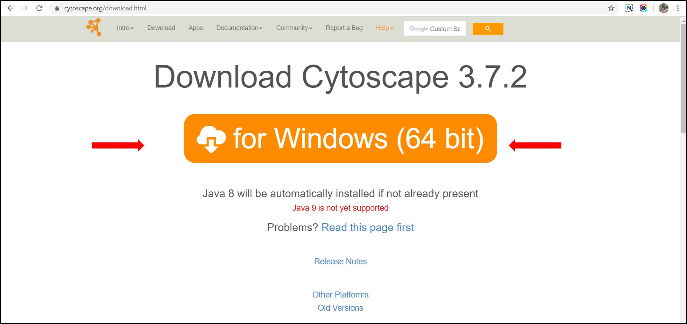
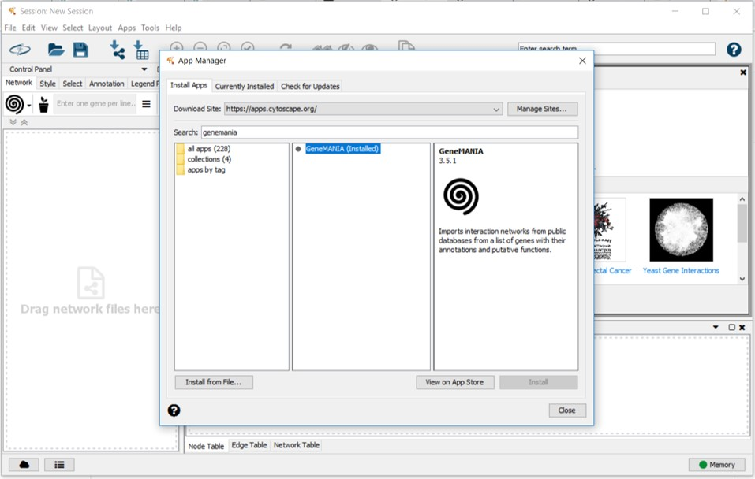
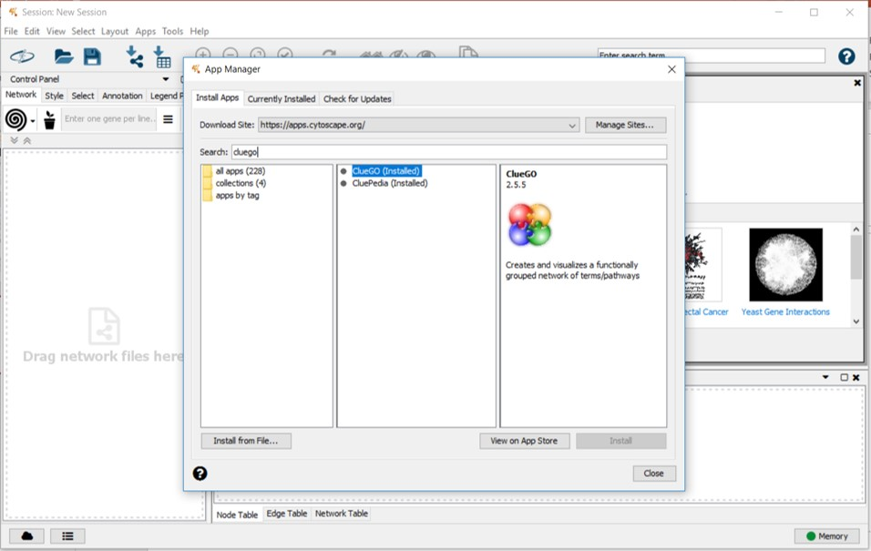
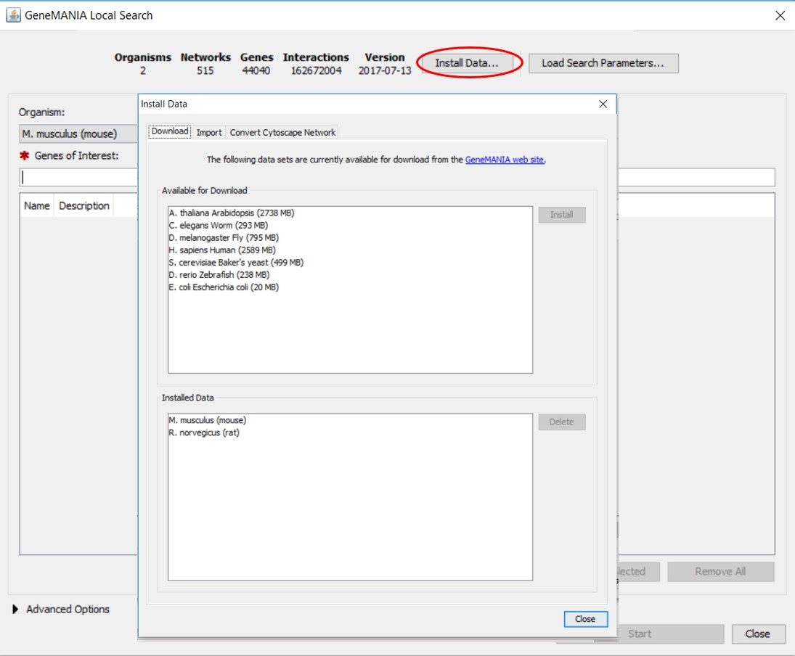
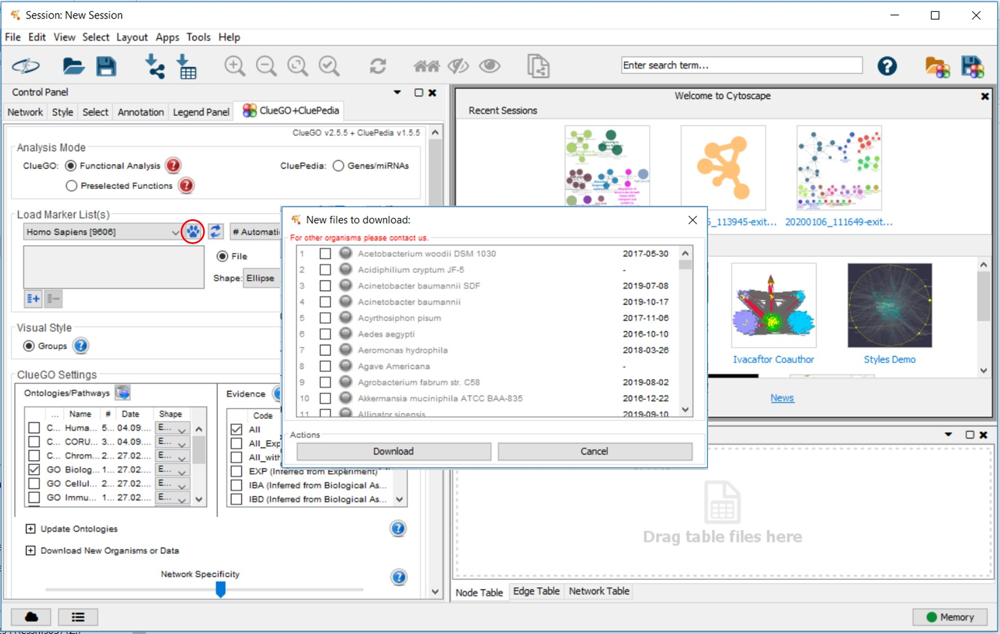

# PINE Installation and Usage

## Table of Contents
- [Requirements and Setup](#requirements-and-setup)

### Requirements and Setup
The following tools and dependencies are required to run the tool-
1. Install [Cytoscape](https://cytoscape.org/download.html)

2. Install Cytoscape Apps\
To install apps within Cytoscape navigate to Apps->App Manager on the tab at the top of the Cytoscape screen. Install the following apps:
- Genemania

- ClueGO (Requires license for usage. Once installation is complete, opening the app prompts license registration)

Once installed apps can be opened by navigating to Apps-> [App Name] on the tab at the top of the Cytoscape screen.
3. Species installation within apps\
PINE currently supports human, mouse and rat analysis. These species datasets must be installed within the following apps:
- Genemania

- ClueGO (by default human and mouse datasets are installed; all other datasets for supported organisms must be installed manually)

4. Download and Install PINE.exe\
Download Pine.Setup.zip file from the the latest [release](https://github.com/Niveda-S/PINE/releases) and extract. Click on the .exe file and follow installation instructions
