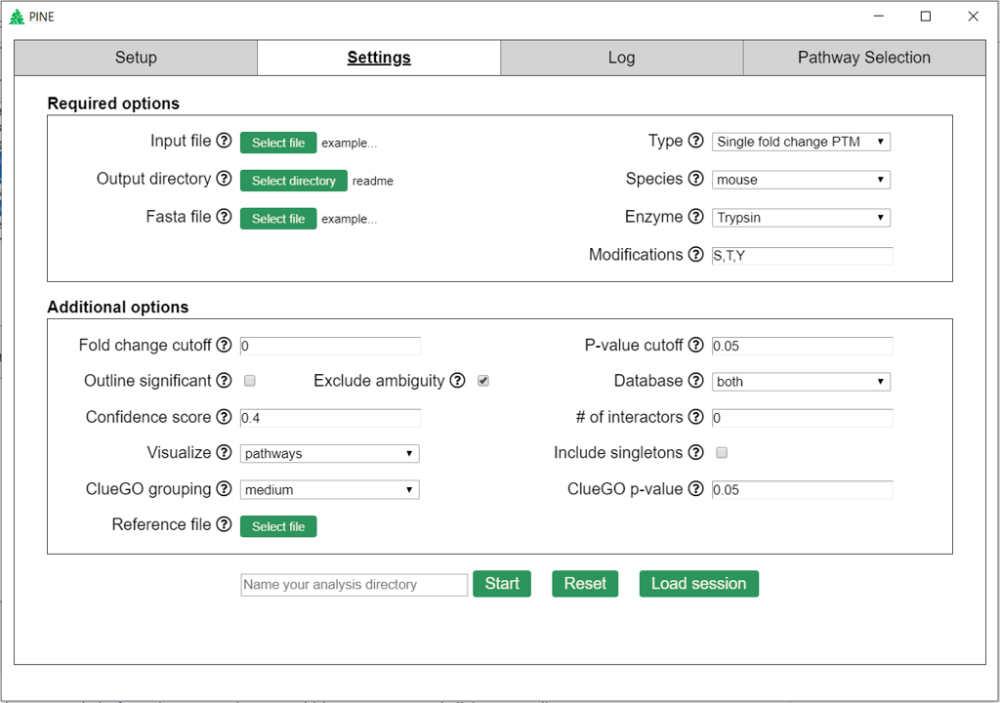

# PINE Installation and Usage

## Table of Contents
- [Requirements and Setup](#requirements-and-setup)
- [Using PINE](#using-pine)
- [Input file description](#input-file-description)
- [Output directory description](#output-directory-description)
- [Command line usage](#command-line-usage)

## Requirements and Setup
The following tools and dependencies are required to run the tool-

### Install [Cytoscape](https://cytoscape.org/download.html)

### Install Cytoscape Apps
To install apps within Cytoscape navigate to Apps->App Manager on the tab at the top of the Cytoscape screen. Install the following apps:
#### [Genemania](http://apps.cytoscape.org/apps/genemania)

#### [ClueGO](http://apps.cytoscape.org/apps/cluego)
ClueGO requires license for usage. Once installation is complete, opening the app prompts license registration

Once installed apps can be opened by navigating to Apps-> [App Name] on the tab at the top of the Cytoscape screen.

### Species installation within apps
PINE currently supports human, mouse and rat analysis. These species datasets must be installed within the following apps:
#### Genemania

####  ClueGO
By default human and mouse datasets are installed; all other datasets for supported organisms must be installed manually.
[ClueGO species installation](Image/cluego-species-install.jpg)

### Download and Install PINE.exe
Download Pine.Setup.zip file from the the latest [release](https://github.com/csmc-vaneykjlab/pine/releases) and extract. Click on the .exe file and follow installation instructions

## Using PINE

### Setting up PINE
When you first launch PINE, it will search your PC for the latest Cytoscape executable and ClueGO configuration directory. If it cannot find them, then you will need to manually provide them.  These settings will be saved so they only need to be provided the first time you use PINE.

### Running an analysis
To begin an analysis, go to the Settings tab.  All required options must be provided before the analysis can be started (see below for an explanation of each option).  Click **Start** to run the analysis.  Click **Load session** to load a previous session.

#### Analysis options
The following are the options that can be set to run an analysis.
- **Input file** (required): The input file in csv format. See more about the input file in the [input file description section](#input-file-description)
- **Type** (required): The type of analysis that will be run. See the [input file description section](#input-file-description) for which types of analysis can be run with which types of input files.
- **Output directory** (required): Path to the output directory. A subdirectory for your results will be created within the output directory. The results subdirectory can optionally be named using the input box at the bottom of the settings page. If the subdirectory is not named, then it will be given a name based on the current time.
- **Species** (required): Which species are used in your analysis. Currently, only mouse, human and rat are supported. The species must be installed by ClueGO and GeneMANIA in order to use that species. By default ClueGO installs with mouse and human.
- **Fold change cutoff**: The fold change cutoff for the input. All fold change or log fold change values `>= cutoff` or `<= -cutoff` will be retained.
- **P-value cutoff**: The p-value cutoff for the input. All p-values or adjusted p-value `<= cutoff` will be retained. If both are provided, adjusted p-value takes precedence.
- **Outline significant**: Outline statistically significant nodes (p-value or adjusted p-value <= 0.05).
- **Exclude ambiguity**: Remove all protein, gene and PTM site level ambiguity. (See ambiguity warning in the log).
- **Database**: Which protein-protein interaction database to use.
- **Confidence score**: Interaction confidence score for STRING. Highest = 0.9, high = 0.7, medium = 0.4, low = 0.15
- **# of interactors**: Maximum number of external interactors.
- **Visualize**: Ontology type. Pathways include REACTOME, KEGG, CLINVAR and Wiki. GO terms for molecular function, biological process and cellular component.
- **ClueGO grouping**: Network specificity indicating general, representative and specific pathways.
- **ClueGO p-value**: P-value cutoff for enrichment analysis.
- **Reference file**: Background reference file containing a list of protein or gene IDs for enrichment analysis in text format.

#### PTM analysis options
 If a PTM type analysis is selected, then three more required options will be needed to run the analysis.
- **Fasta file** (required): Fasta file for finding locations of PTMs within the protein.
- **Enzyme** (required): Digestion enzyme used.
- **Modifications** (required): Comma separated list of modifications of interest.

### Log
While PINE is running, output is written to the log. A copy of the log will also be saved to PINE.log within the output subdirectory. The analysis can be cancelled at anytime from this tab.

When the PINE analysis is complete, you can view the interaction network by going to the Network tab and selecting the Interaction Network.

### Pathway selection
After a PINE analysis successfully completes, the pathway selection tab will load which shows all the pathways and GO terms found from ClueGO analysis. Pathways and GO terms can be selected for reanalysis on the subset of genes found within these terms. The reanalysis can be given a custom name. If a name is not given, then it will automatically named based on the current time. After selecting one or more terms or pathways, click "Reanalyze" to begin the reanalysis.

From this tab, you can also open the results folder ([see here for results description](#output-directory-description)) and the Cytoscape file of the most recent analysis.

After reanalysis is complete, there will be a new interaction network which contains only the genes from the selected pathways and terms and an ontology network shows which genes are included in the selected pathways and terms.

## Input file description
All input files must be in CSV (comma separated value) format.  All column names are case-insensitive.

**No fold change**

| Column | Input column name |
| ------ | ---------------- |
| Uniprot ID | `proteinid` |

**Single fold change**

| Column | Input column name |
| ------ | ---------------- |
| Uniprot ID | `proteinid` |
| Fold change | `fc` |

**Multi fold change**

| Column | Input column name |
| ------ | ---------------- |
| Uniprot ID | `proteinid` |
| Fold change | `fc` |
| Label | `label` |

**Category**

| Column | Input column name |
| ------ | ---------------- |
| Uniprot ID | `proteinid` |
| Category | `category` |

**Single fold change PTM**

| Column | Input column name |
| ------ | ---------------- |
| Uniprot ID | `proteinid` |
| Peptide sequence | `peptide` |
| Fold change | `fc` |

**Multi fold change PTM**

| Column | Input column name |
| ------ | ---------------- |
| Uniprot ID | `proteinid` |
| Peptide sequence | `peptide` |
| Fold change | `fc` |
| Label | `label` |

## Output directory description
A directory is created in the specified output directory after the analysis completes.  This directory will contain six files:
- **Interactions.csv** - The results for each Protein ID in the analysis.
- **PINE.cluego.txt** - Pathways and GO terms found to be significant by ClueGO.
- **PINE.cys** - The Cytoscape file containing the interaction network.
- **PINE.log** - Log of analysis.
- **settings-gui.json** - Settings from the GUI that were provided to the PINE Python script.  This file should not be modified because it is used to retrieve the settings when the session is reloaded.
- **timestamp.json** - The time when the analysis was run.  This file should not be modified.

## Command line usage
### Requirements
- All the requirements listed [above](#requirements-and-setup)
- Python3

### Installation
`pip install git+https://https://github.com/csmc-vaneykjlab/pine.git#egg=pine`

It is strongly recommended you use a virtual environment for installing PINE.

After installing, PINE can be run using `python3 -m pine.pine --help`

### Command line parameters

## Support
If you have any questions about PINE, please contact us at GroupHeartBioinformaticsSupport@cshs.org.

## License
See the [LICENSE](https://github.com/csmc-vaneykjlab/pine/blob/master/LICENSE) file for license rights and limitations (Apache 2.0).