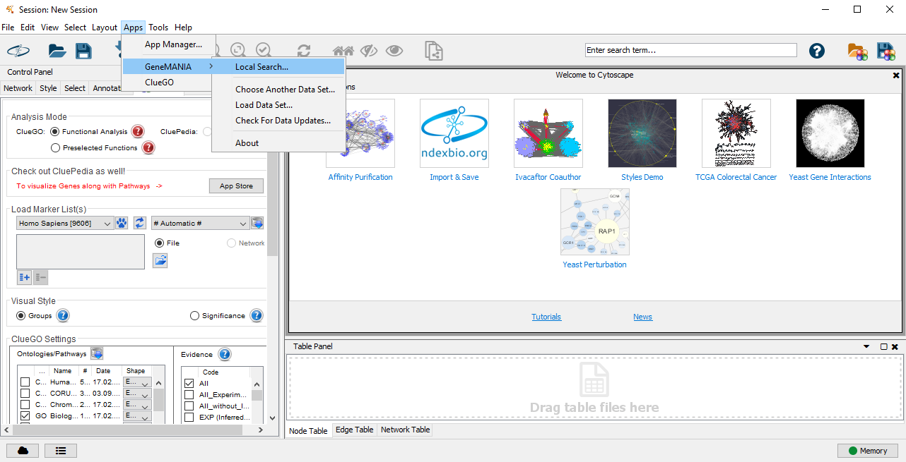
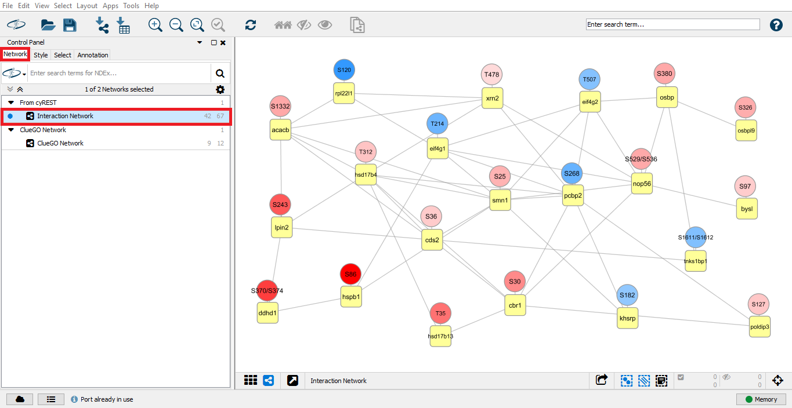
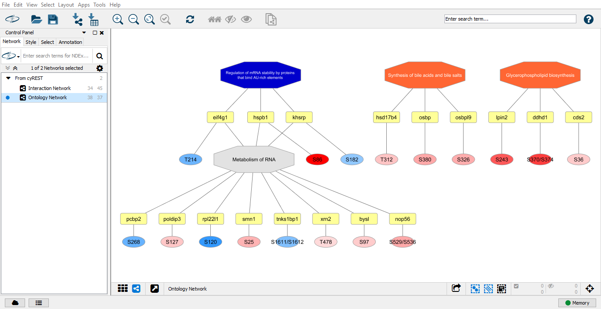

# PINE Installation and Usage

## Table of Contents
- [What is PINE](#what-is-pine)
- [Requirements and Setup](#requirements-and-setup)
- [Using PINE GUI](#using-pine-gui)
- [Customized Styling in Cytoscape](#customized-styling-in-cytoscape)
- [Using PINE command line](#using-pine-command-line)
- [Input file description](#input-file-description)
- [Output directory description](#output-directory-description)
- [Cite us](#cite-us)
- [Support](#support)
- [License](#license)

## What is PINE
PINE (**P**rotein **I**nteraction **N**etwork **E**xtractor) is a tool for visualizing protein-protein interactions.  PINE is provided in two forms: a command line version built in Python and a graphical user interface (GUI).

## Requirements and Setup
The following tools and dependencies are required to run PINE:
- [Cytoscape](https://cytoscape.org/download.html) (version 3.7 and above)
- [Genemania](http://apps.cytoscape.org/apps/genemania) (version 3.5 and above)
- [ClueGO](http://apps.cytoscape.org/apps/cluego) (version 2.5 and above)

The PINE graphical user interface is only available for Windows.

### Install [Cytoscape](https://cytoscape.org/download.html)


### Install Cytoscape Apps
To install apps, open Cytoscape and navigate to Apps->App Manager on the tab at the top of the Cytoscape window. Install the following apps:
#### [Genemania](http://apps.cytoscape.org/apps/genemania)

#### [ClueGO](http://apps.cytoscape.org/apps/cluego)
ClueGO requires license for usage. Once installation is complete, opening the app prompts license registration


Once installed apps can be opened by navigating to Apps-> [App Name] on the tab at the top of the Cytoscape screen.

### Species installation within apps
PINE currently supports human, mouse and rat analysis. These species datasets must be installed within the following apps:
#### Genemania

If you've never used Genemania before, navigate to Apps -> GeneMANIA -> Local Search...



Then select the latest dataset


Then select which species you would like to install


If you've used Genemania before, then open the App within Cytoscape and click on Install Data...


####  ClueGO
By default human and mouse datasets are installed; all other datasets for supported organisms must be installed manually.


### Download PINE
Download and run pine-setup.exe from the latest [release](https://github.com/csmc-vaneykjlab/pine/releases/latest/download/pine-setup.exe).

### Windows Defender Smartscreen
You may encounter the following error when running the PINE setup:


To allow PINE to install, right click on the PINE icon within your Downloads folder and select Properties (if you clicked "Run" instaed of "Download", you will have to [download](https://github.com/csmc-vaneykjlab/pine/releases/latest/download/pine-setup.exe) the file again and save it in a folder on your system):


At the bottom of the Properties in the Security section, click the checkbox labeled "Unblock" then click "Apply":


Windows Defender should now allow you to install PINE.

### Install PINE
Open the pine-setup.exe file and follow installation instructions.

Choose if you want to install for a single user account or for all users on the system:


Select the installation directory:


After installation completes you can run PINE:


### Example usage
Please refer to our single fold change [example](examples/single%20fold%20change%20PTM) for a walkthrough on how to use PINE.

## Using PINE GUI

### Setting up PINE
When you first launch PINE, it will search your PC for the latest Cytoscape executable and ClueGO configuration directory. If it cannot find them, then you will need to manually provide them.  These settings will be saved so they only need to be provided the first time you use PINE.


### Running an analysis
To begin an analysis, go to the Settings tab.  All required options must be provided before the analysis can be started (see below for an explanation of each option).  Click **Start** to run the analysis.  Click **Load session** to load a previous session.


#### Analysis options
The following are the options that can be set to run an analysis.
- **Input file** (required): The input file in csv format. See more about the input file in the [input file description section](#input-file-description)
- **Type** (required): The type of analysis that will be run. See the [input file description section](#input-file-description) for which types of analysis can be run with which types of input files.
- **Output directory** (required): Path to the output directory. A subdirectory for your results will be created within the output directory. The results subdirectory can optionally be named using the input box at the bottom of the settings page. If the subdirectory is not named, then it will be given a name based on the current time.
- **Species** (required): Which species are used in your analysis. Currently, only mouse, human and rat are supported. The species must be installed by ClueGO and GeneMANIA in order to use that species. By default ClueGO installs with mouse and human.
- **Fold change cutoff**: The fold change cutoff for the input. All fold change or log fold change values `>= cutoff` or `<= -cutoff` will be retained.
- **P-value cutoff**: The p-value cutoff for the input. All p-values or adjusted p-value `<= cutoff` will be retained. If both are provided, adjusted p-value takes precedence.
- **Outline significant**: Outline statistically significant nodes (p-value or adjusted p-value <= 0.05).
- **Exclude ambiguity**: Remove all protein, gene and PTM site level ambiguity. (See ambiguity warning in the log).
- **Database**: Which protein-protein interaction database to use.
- **Confidence score**: Interaction confidence score for STRING. Highest = 0.9, high = 0.7, medium = 0.4, low = 0.15
- **# of interactors**: Maximum number of external interactors.
- **Visualize**: Ontology type. Pathways include REACTOME, KEGG, CLINVAR and Wiki. GO terms for molecular function, biological process and cellular component.
- **ClueGO grouping**: Network specificity indicating general, representative and specific pathways.
- **ClueGO p-value**: P-value cutoff for enrichment analysis.
- **Reference file**: Background reference file containing a list of protein or gene IDs for enrichment analysis in text format.

#### PTM analysis options
 If a PTM type analysis is selected, then three more required options will be needed to run the analysis.
- **Fasta file** (required): Fasta file for finding locations of PTMs within the protein.
- **Enzyme** (required): Digestion enzyme used.
- **Modifications** (required): Comma separated list of modifications of interest.

### Log
While PINE is running, output is written to the log. A copy of the log will also be saved to PINE.log within the output subdirectory. The analysis can be cancelled at anytime from this tab.


When the PINE analysis is complete, you can view the interaction network by going to the Network tab and selecting the Interaction Network.



### Pathway selection
After a PINE analysis successfully completes, the pathway selection tab will load which shows all the pathways and GO terms found from ClueGO analysis. Pathways and GO terms can be selected for reanalysis on the subset of genes found within these terms. The reanalysis can be given a custom name. If a name is not given, then it will automatically named based on the current time. After selecting one or more terms or pathways, click "Reanalyze" to begin the reanalysis.

From this tab, you can also open the results folder ([see here for results description](#output-directory-description)) and the Cytoscape file of the most recent analysis.


After reanalysis is complete, there will be a new interaction network which contains only the genes from the selected pathways and terms and an ontology network shows which genes are included in the selected pathways and terms.



## Customized Styling in Cytoscape

### Layout
It is recommended to install the Cytoscape App yFiles Layout Algorithms to improve your layouts after PINE has finished building your network. To install navigate to Apps->App Manager on the tab at the top of the Cytoscape screen.
Appropriate yFiles layout can be chosen by selecting from options available in the Layout tab at the top of the Cytoscape screen. For example, figures 4 and 5 in the manuscript have been constructed using yFiles Organic Layout. Figures 6 and 7 have been constructed using yFiles Heirarchic Layout. 

### Font
To change font, navigate to the Style Tab on the Control Panel on the left side of the Cytoscape screen. 'Label Font Size' is the option to set node font size. Font has been set by PINE based on length of node text. To change, the range of minumum and maximum font must be modified.
Open up the node font size section by clicking on the dropdown arrow. Double-click on the current mapping graph. This opens up a new tab called Continuous Mapping Editor. Move the node label font size pointer up or down to increase or decrease font size respectively.


Alternatively, to change font sizes of specific node labels, click to select the required node and select the bypass box for Label Font Size on the Style tab. This opens up a new tab where node label font size for the selected node can be set.


### Colors
**Color Gradient for single fold change type networks**  
To modify color of fold change greadient for the nodes, navigate to the Style Tab on the Control Panel on the left side of the Cytoscape screen. 'Fill Color' controls node colors.   
Open up the fill color section by clicking on the dropdown arrow. Double-click on the current mapping gradient. This opens up a new tab called Continuous Mapping Editor. Set a new gradient by double-clicking on the arrow buttons for fold changes that are up-regulated (>0) and down regulated(<0) and setting new colors from a color palette.  


**Bar and Pie Charts for multiple fold change or category type networks**  
The colors of the bar and pie charts can be modified by navigating to the 'Image/Chart' option on the Style Tab. Click on the currently configured bar chart to open up a Graphics tab. Its options section shows the currently configured colors. Double-clicking on the colors opens up a color palette allowing you to make any changes.  
  

Additionally, for bar charts, the option is provided to include:  
- **Value Labels** in the bar showing the numeric value that represents height of the bar. Select 'Show Value Labels' and choose the PINE generated column pine_value_label to enable this option  
- **Domain Labels** showing bar labels. Select 'Show Domain Axis' and choose the PINE generated column pine_domain_label to enable this option   


This labels bar charts appropriately as below:  
  

## Using PINE command line

### Requirements
- All the requirements listed [above](#requirements-and-setup)
- Python3

### Installation
`pip install git+https://github.com/csmc-vaneykjlab/pine.git#egg=pine`

It is strongly recommended you use a virtual environment for installing PINE.

After installing, PINE can be run using `python3 -m pine.pine --help`

### Usage
```
python3 -m pine.pine -i input.csv -o output_dir -c cluego_out.txt -t input_type -s species -m cluego_map_file.gz --cytoscape-executable path_to_exe
```

### Command line parameters
| Parameter | Description |
| --------- | ----------- |
| -i, --in | input file in csv format with the following headers as applicable: ProteinID, FC, pval, adj.pval, Label, Category, Peptide |
| -o, --output | path to output directory |
| -t, --type | analysis type [Allowed: noFC, singleFC, multiFC, category, singlefc-ptm, multifc-ptm] |
| -s, --species | species [Allowed: human, mouse, rat] |
| -x, --enzyme | (required if singlefc-ptm or multifc-ptm) enzyme name [Allowed: Trypsin, Trypsin_p, Lys_n, Asp_n, Arg_c, Chymotrypsin, Lys_c] |
| -d, --mods | (required if singlefc-ptm or multifc-ptm) comma separated list of modifications of interest [Example: S,T,Y or K(Unimod:1) or S[+80]] |
| -b, --fastafile | (required if singlefc-ptm or multifc-ptm) path to fasta file |
| -m, --mapping | path to cluego mapping file compressed in .gz format |
| -e, --cytoscape-executable | the path to the Cytoscape executable |
| -f, --fccutoff | (optional) fold change cutoff for input [Default: abs(FC) >= 0.0] |
| -p, --pvalcutoff | (optional) pvalue cutoff for input [Default: pval > 1.0] |
| -n, --significant | (optional) outline statistically significant nodes, i.e pval>0.0 |
| -k, --exclude-ambiguity | (optional) exclude ambigious genes and sites |
| -u, --run | (optional) interaction databases [Allowed: string, genemania, both; Default: both] |
| -r, --score | (optional) interaction confidence score for string [Default:0.4, Range 0-1] |
| -l, --limit | (optional) maximum number of external interactors [Default:0, Range:0-100] |
| -z, --visualize | (optional) ontology type [Allowed: biological process, cellular component, molecular function, pathways, all; Default: pathways].  Pathways include REACTOME, KEGG, CLINVAR, CORUM and Wiki. |
| -g, --grouping | (optional) network specificity indicating general, representative and specific pathways [Allowed: global, medium, detailed; Default: medium] |
| -y, --cluegopval | (optional) pvalue cutoff for enrichment analysis [Default: 0.05] |
| -h, --referencepath | (optional) path to background reference file for enrichment |
| -a, --inputcluego | (optional) filtered cluego file with ontology terms of interest |

## Input file description
All input files must be in CSV (comma separated value) format.  All column names are case-insensitive.

**No fold change**

| Column | Input column name |
| ------ | ---------------- |
| Uniprot ID | `proteinid` |

**Single fold change**

| Column | Input column name |
| ------ | ---------------- |
| Uniprot ID | `proteinid` |
| Fold change | `fc` |

**Multi fold change**

| Column | Input column name |
| ------ | ---------------- |
| Uniprot ID | `proteinid` |
| Fold change | `fc` |
| Label | `label` |

**Category**

| Column | Input column name |
| ------ | ---------------- |
| Uniprot ID | `proteinid` |
| Category | `category` |

**Single fold change PTM**

| Column | Input column name |
| ------ | ---------------- |
| Uniprot ID | `proteinid` |
| Peptide sequence | `peptide` |
| Fold change | `fc` |

**Multi fold change PTM**

| Column | Input column name |
| ------ | ---------------- |
| Uniprot ID | `proteinid` |
| Peptide sequence | `peptide` |
| Fold change | `fc` |
| Label | `label` |

## Output directory description

A directory is created in the specified output directory after the analysis completes.  This directory will contain six files:
- **Interactions.csv** - The results for each Protein ID in the analysis.
- **PINE.cluego.txt** - Pathways and GO terms found to be significant by ClueGO.
- **PINE.cys** - The Cytoscape file containing the interaction network.
- **PINE.log** - Log of analysis.
- **settings-gui.json** - Settings from the GUI that were provided to the PINE Python script.  This file should not be modified because it is used to retrieve the settings when the session is reloaded.
- **timestamp.json** - The time when the analysis was run.  This file should not be modified.

## Cite us
Niveda Sundararaman, James Go, Aaron E. Robinson, José M. Mato, Shelly C. Lu, Jennifer E. Van Eyk, Vidya Venkatraman. "PINE: An Automation Tool to Extract & Visualize Protein-Centric Functional Networks". Manuscript submitted (2020).

## Support
If you have any questions about PINE, please contact us at GroupHeartBioinformaticsSupport@cshs.org.

## License
See the [LICENSE](https://github.com/csmc-vaneykjlab/pine/blob/master/LICENSE) file for license rights and limitations (Apache 2.0).
