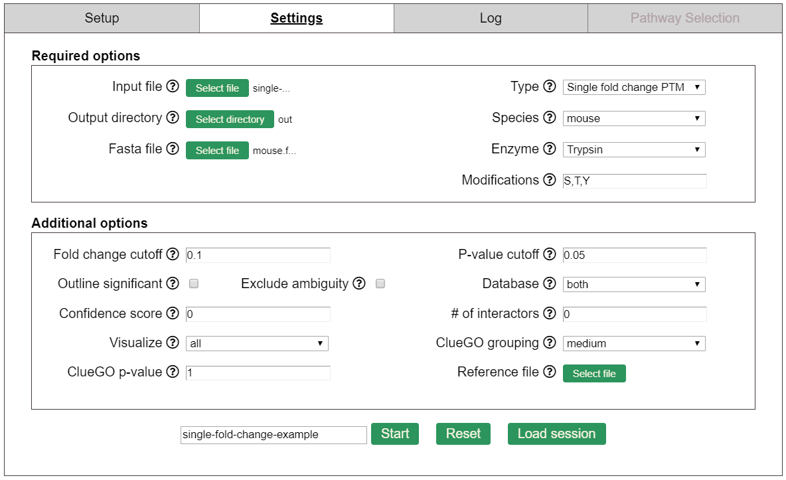
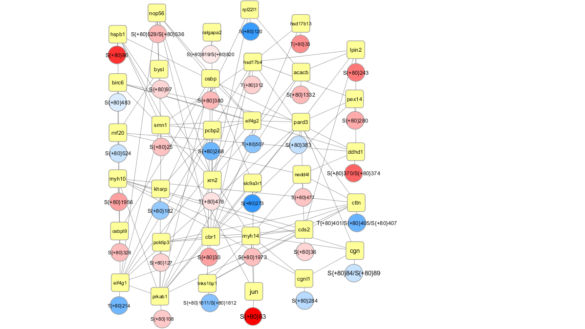
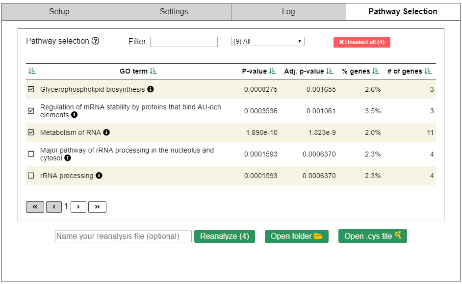
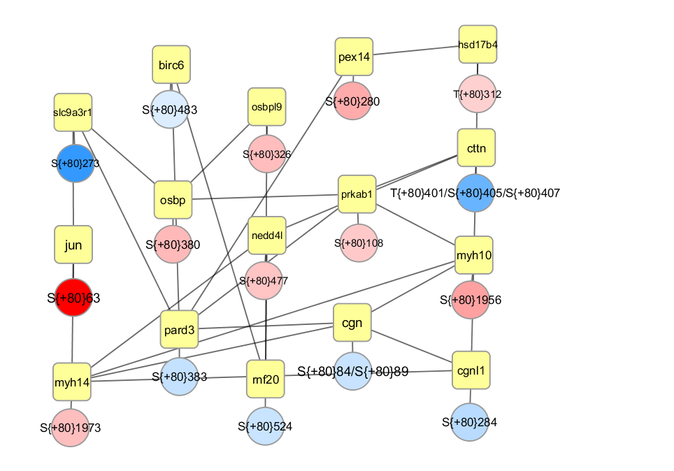
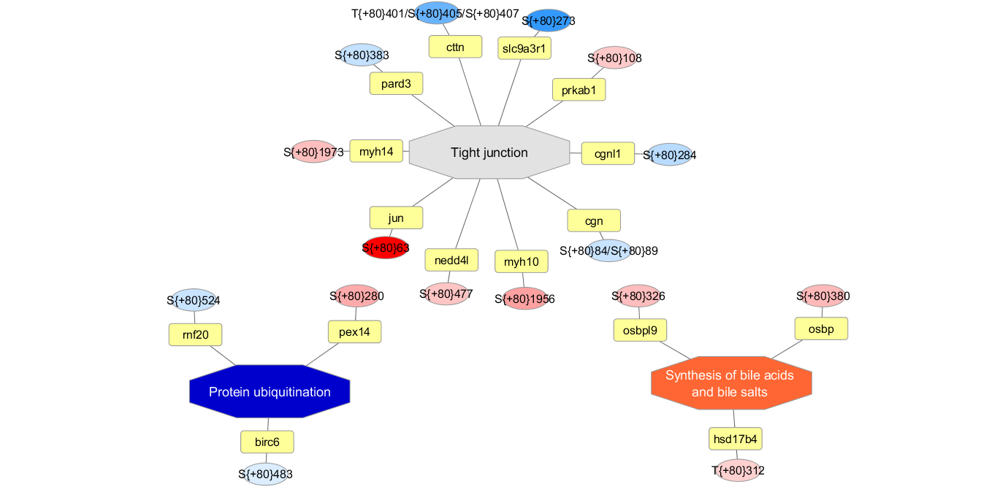

# Single fold change PTM example
This guide will walk you through an example PINE analysis using for single fold changes PTMs.

## Download the example files
Download [example-mouse-single-FC.zip](https://raw.githubusercontent.com/csmc-vaneykjlab/pine/master/examples/single%20fold%20change%20PTM/files/example-mouse-single-FC.zip) and extract the contents.

## Open PINE and set the run parameters
Make sure PINE was able to find your Cytoscape.exe and ClueGO configuration folder.  You'll need to provide the locations if it can't find them.
- Select the **example-mouse-single-FC.csv** that was downloaded as your input file.
- Set type to **Single fold change PTM**.
- Select an output directory to write your results.
- Set the species to **mouse**.
- Select the **example-mouse-uniprot.fasta** that was downloaded as your fasta file.
- Set the enzyme to **Typsin**.
- Set the modifications to **S,T,Y**.
- Set fold change cutoff to **0**.
- Set p-value cutoff to **0.05**.
- **Uncheck** outline significant.
- **Check** exclude ambiguity.
- Set database to **both**.
- Set confidence score to **0.4**.
- Set # of interactors to **0**.
- Set visualize to **pathways**.
- Set ClueGO grouping to **medium**.
- Set ClueGO p-value to **0.05**.
- Do not add a reference file.
- Name your analysis directory **single-fold-change-example**.

Your settings should look like the following when you're done.  Click **Start** to run.

## Analysis results
After PINE finishes running, you can go to the **Network** tab in the Cytoscape control panel and select the **Interaction Network**.  This is the single fold change interaction network.  Each yellow square is a gene and the circles represent fold changes for PTMS on the genes' proteins.  Your network should look similar to the image below.  We recommend installing the [yFiles Layout Algorithms plugin](http://apps.cytoscape.org/apps/yfileslayoutalgorithms) and using the yFiles Organic Layout to layout your networks.

## Pathway selection
You can now refine your results by selecting different pathways or GO terms to reanalyze with.  Go back to PINE and select a few terms, then click **Reanalyze**.  In the following example "Tight junction", "Protein ubiquitination" and "Synthesis of bile acids and bile salts"  were selected.

## Reanalysis results
After the PINE reanalysis completes, you will have two networks in your Cytoscape session.  The first is a new interaction network containing only genes from the terms you selected.  The second is an ontology network for associations between genes and the selected ontologies.

**New interaction network:**  

**Ontology network:**

To create a similar network arrangement, install the [yFiles Layout Algorithms plugin](http://apps.cytoscape.org/apps/yfileslayoutalgorithms) then select **Layouts** -> **yFiles Hierarchic Layout**.
