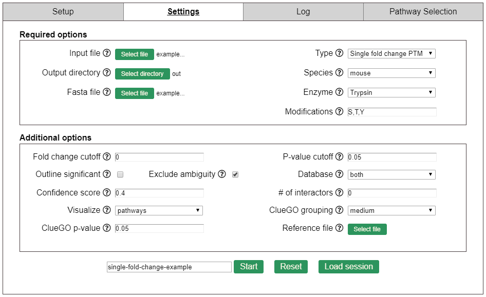

# Single fold change PTM example
## Download the example files
You'll need the **single-fold-change-data.csv** and **mouse.fasta** to run this example.
## Open PINE and set the run parameters
Make sure PINE was able to find your Cytoscape.exe and ClueGO configuration folder.  You'll need to provide the locations if it can't find them.
- Select the **single-fold-change-data.csv** as your input file.
- Set type to **Single fold change PTM**.
- Select an output directory to write your results.
- Set the species to **mouse**.
- Select the **mouse.fasta** as your fasta file.
- Set the enzyme to **Typsin**.
- Set the modifications to **S,T,Y**.
- Set fold change cutoff to **0.1**.
- Set p-value cutoff to **0.05**.
- **Uncheck** outline significant.
- **Uncheck** exclude ambiguity.
- Set database to **both**.
- Set confidence score to **0**.
- Set # of interactors to **0**.
- Set visualize to **all**.
- Set ClueGO grouping to **medium**.
- Set ClueGO p-value to **1**.
- Do not add a reference file.
- Name your analysis directory **single-fold-change-example**.

Your settings should look like the following when you're done.  Click **Start** to run.
